<script src="https://cdnjs.cloudflare.com/ajax/libs/mermaid/10.3.1/mermaid.min.js"></script>
<script>
  document.addEventListener('DOMContentLoaded', function () {
    mermaid.initialize({ startOnLoad: true });
  });
</script>

# Relatório WebGoat

- [Relatório WebGoat](#relatório-webgoat)
  - [Metodologia](#metodologia)
  - [Ferramentas](#ferramentas)
  - [Objetivo](#objetivo)
  - [Escopo](#escopo)
  - [Sumário Executivo](#sumário-executivo)
- [Vulnerabilidades](#vulnerabilidades)
  - [SQL Injection](#sql-injection)
  - [JWT Tokens](#jwt-tokens)
  - [Stored XSS](#stored-xss)


## Metodologia

**1. Preparação**

A fase de preparação envolveu a definição clara do objetivo e escopo do projeto, seguida pela configuração do ambiente local do WebGoat em um ambiente controlado, garantindo segurança durante os testes. Todas as ferramentas necessárias foram configuradas e verificadas para assegurar sua funcionalidade. Por fim, as lições do WebGoat foram revisadas para identificar as vulnerabilidades selecionadas para análise.

**2. Exploração**

Os testes direcionados foram realizados utilizando uma combinação de técnicas manuais e automatizadas, validando e explorando as vulnerabilidades identificadas. A execução ocorreu exclusivamente no ambiente controlado, assegurando que os resultados refletem cenários realistas sem risco a outros sistemas. Cada etapa foi registrada com evidências visuais e técnicas para comprovar os impactos das vulnerabilidades exploradas.

**3. Documentação**

Cada vulnerabilidade foi documentada de maneira detalhada, incluindo:
  - Descrição: Explicação técnica sobre a falha e os riscos associados.
  - Exploração: Resumo das etapas realizadas, ferramentas empregadas e resultados obtidos, com suporte visual.
  - Impacto: Avaliação objetiva dos riscos à confidencialidade, integridade e disponibilidade do sistema.
  - Mitigação: Recomendações práticas e específicas para corrigir ou prevenir a vulnerabilidade.
  - Referências: Links diretos para CWE, OWASP e CVSS, permitindo acesso às fontes técnicas e ao cálculo de gravidade.


## Ferramentas
- [Burp Suite](https://portswigger.net/burp)
- [Firefox](https://www.mozilla.org/)
- [JWT.IO](https://jwt.io/)
- [Docker](https://www.docker.com/)
- [VSCode](https://code.visualstudio.com/)
- [GitHub](https://github.com/)
- [CVSS 3.1 Calculator](https://www.first.org/cvss/calculator/3.1)
- [OWASP Top 10](https://owasp.org/www-project-top-ten/)
- [CWE](https://cwe.mitre.org/)

## Objetivo
Este relatório tem como objetivo principal demonstrar a identificação, análise e exploração de vulnerabilidades encontradas na plataforma WebGoat. Além de evidenciar os impactos técnicos e operacionais dessas falhas, o relatório apresenta recomendações práticas e estruturadas para mitigação, alinhando-se às melhores práticas de segurança.

## Escopo

A análise foi realizada em uma instância local do WebGoat, configurada em um ambiente seguro e controlado. As vulnerabilidades exploradas incluem:

- SQL Injection: Foco em injeções SQL avançadas que permitem manipular o banco de dados.
- JWT Tokens: Análise de falhas relacionadas à manipulação e validação inadequada de tokens.
- Stored XSS: Exploração de vulnerabilidades que permitem a execução de scripts maliciosos armazenados.

## Sumário Executivo

A análise realizada no WebGoat identificou vulnerabilidades críticas que apresentam riscos significativos à segurança do sistema. Cada vulnerabilidade foi explorada em um ambiente controlado, demonstrando seus impactos potenciais e fornecendo recomendações práticas de mitigação. A tabela a seguir resume as vulnerabilidades, seus impactos principais e a pontuação CVSS atribuída:

| **Vulnerabilidade** | **Impacto Principal**                          | **CVSS 3.1 (Gravidade)** | **Categoria OWASP**       |
|----------------------|-----------------------------------------------|--------------------------|---------------------------|
| SQL Injection        | Exfiltração de dados e escalonamento de privilégios | 9.8 (Crítico)            | A03: Injection            |
| JWT Tokens           | Escalonamento de privilégios                 | 9.1 (Crítico)            | A01: Broken Access Control |
| Stored XSS           | Execução de scripts maliciosos no backend    | 8.5 (Alto)               | A03: Injection            |

**Recomendações Gerais**

Para mitigar os riscos identificados, é recomendado:

1. **Validação e Sanitização de Entradas:** Implementar validações rigorosas para todas as entradas de usuário, evitando a execução de comandos ou scripts maliciosos.
2. **Gerenciamento Seguro de Tokens:** Utilizar algoritmos robustos para assinatura de tokens e garantir que tokens manipulados sejam rejeitados.
3. **Política de Segurança de Conteúdo (CSP):** Configurar uma Content Security Policy que limite a execução de scripts não confiáveis e proteja contra ataques XSS.
4. **Monitoramento Ativo:** Estabelecer sistemas de monitoramento para detectar tentativas de exploração e comportamentos suspeitos em tempo real.


# Vulnerabilidades 

## SQL Injection

**Descrição**  
SQL Injection ocorre quando a aplicação não valida adequadamente as entradas do usuário, permitindo a execução de comandos SQL maliciosos no banco de dados. Isso pode resultar em exfiltração de dados sensíveis, manipulação de registros e acesso não autorizado a funcionalidades internas.

**Exploração**

1. Teste Inicial
   - Um teste básico foi conduzido no campo `Name` utilizando o seguinte payload:
       ```sql
       ' OR '1'='1
       ```
   - Saída Observada: A consulta retornou todos os registros da tabela user_data, confirmando a vulnerabilidade.

       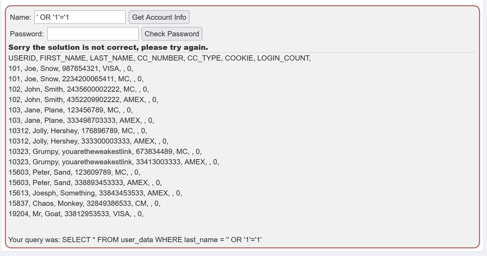

2. Enumeração do Schema do Banco de Dados

   - Para identificar tabelas adicionais no banco de dados, foi utilizado o seguinte payload:

       ```sql
       ' UNION SELECT null, table_name, null, null, null, null, null FROM information_schema.tables -- 
       ```
   - Saída Observada: A tabela `user_system_data` foi identificada como potencialmente relevante, indicando que pode armazenar informações sensíveis.

       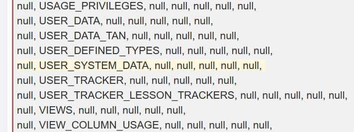

3. Extração de Dados

   - Após a identificação da tabela, os dados foram extraídos utilizando o seguinte payload:
     
       ```sql
       x'; SELECT * FROM user_system_data; --
       ```

   - Saída Observada: Dados sensíveis, como nomes de usuários e senhas, foram obtidos com sucesso da tabela especificada.

       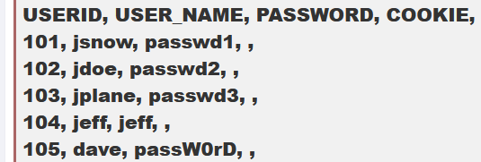

**Diagrama de Fluxo**
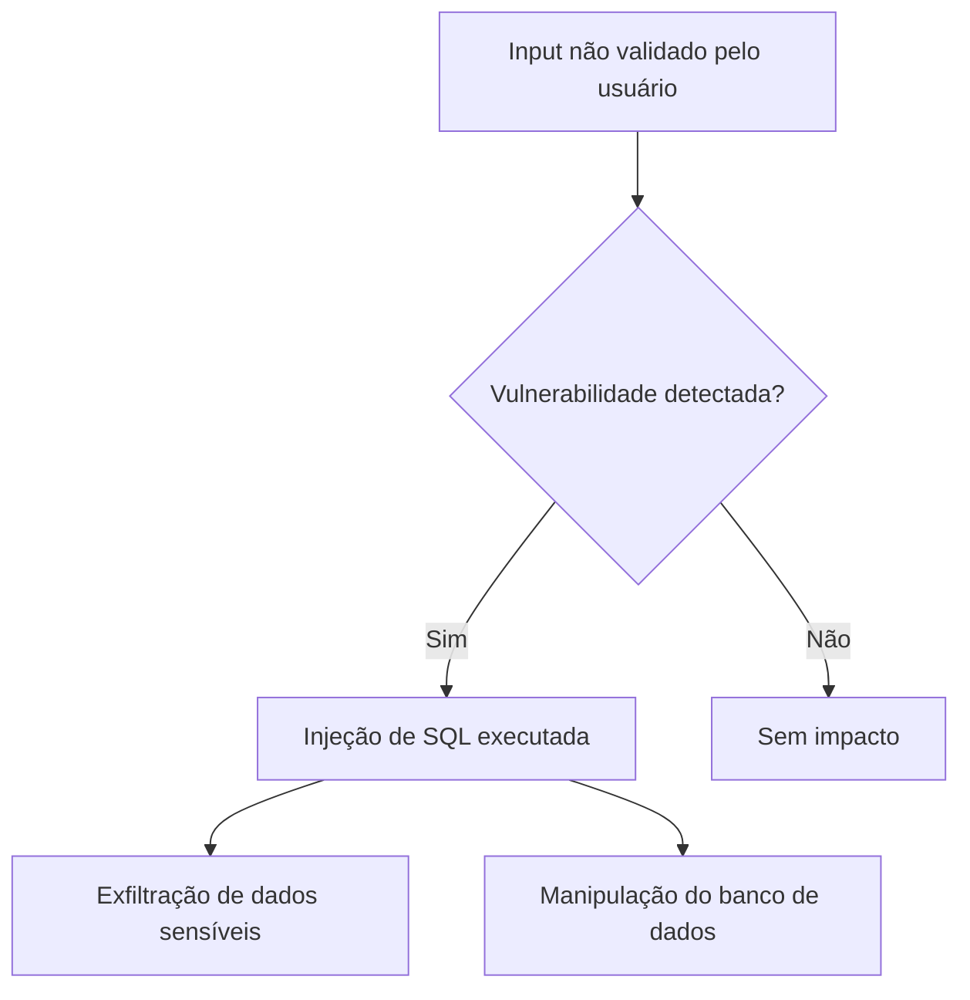


**Impacto**

- **Exposição de Dados Sensíveis:** A exposição de credenciais de usuários compromete diretamente a confidencialidade dos dados armazenados.
- **Escalonamento de Privilégios:** O acesso às credenciais do backend pode permitir a manipulação de dados ou a execução de comandos críticos.

**CWE (Common Weakness Enumeration)**
- [CWE-89: Improper Neutralization of Special Elements used in an SQL Command ('SQL Injection')](https://cwe.mitre.org/data/definitions/89.html).

**OWASP Top 10**
- [A03: Injection](https://owasp.org/Top10/A03_2021-Injection/)

**CVSS (Common Vulnerability Scoring System):**
- 9.8 (Critical)

    [CVSS:3.1/AV:N/AC:L/PR:N/UI:N/S:U/C:H/I:H/A:H](https://www.first.org/cvss/calculator/3.1#CVSS:3.1/AV:N/AC:L/PR:N/UI:N/S:U/C:H/I:H/A:H)

**Mitigação**

- **Uso de Query Parameters:** Implementar `prepared statements` ou `ORMs` que separam a lógica da consulta SQL dos dados fornecidos pelo usuário.
- **Validação Rigorosa de Entradas:** Realizar validação rigorosa de todas as entradas recebidas, garan tindo que apenas valores esperados sejam aceitos.
- **Restringir Privilégios no Banco de Dados:** Limitar as permissões do banco de dados para que apenas operações necessárias sejam executadas.
- **Monitoramento de Logs:** Implementar um sistema de monitoramento para detectar atividades suspeitas, como tentativas de SQL Injection.


## JWT Tokens


**Descrição**  
JSON Web Tokens (JWT) são amplamente utilizados para autenticação e autorização, armazenando informações codificadas em formato `Base64`. Implementações inseguras podem permitir a falsificação de tokens, escalonamento de privilégios e acesso não autorizado a recursos protegidos.

**Exploração**

  1. Análise Inicial do Token
   
        - O token capturado indicava o uso do algoritmo `HS512`, que requer uma chave compartilhada para assinatura. Após decodificação, o payload confirmou que o usuário Tom não possuía privilégios administrativos.

            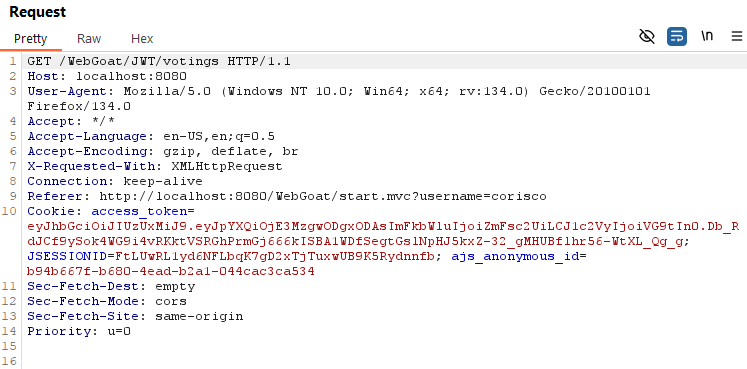


            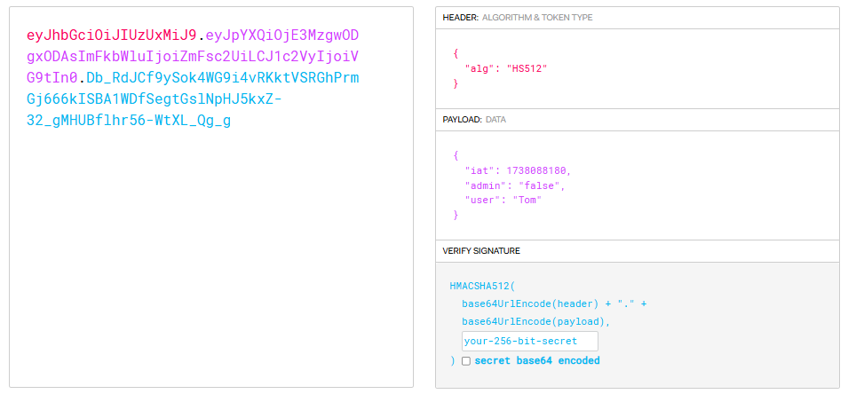


  2. Manipulação do Token

        - O algoritmo foi alterado de `HS512` para `none`, removendo a necessidade de uma assinatura válida. O campo `admin` foi modificado para `true`, simulando privilégios administrativos.

            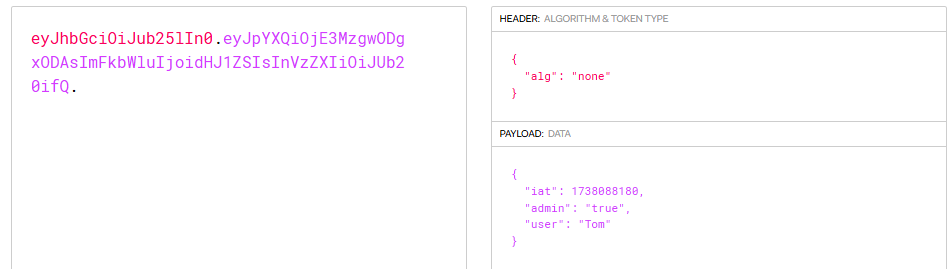

  3. Interceptação do Token Modificado

        - O token manipulado foi enviado no cabeçalho de autorização. O sistema aceitou o token e concedeu acesso administrativo

            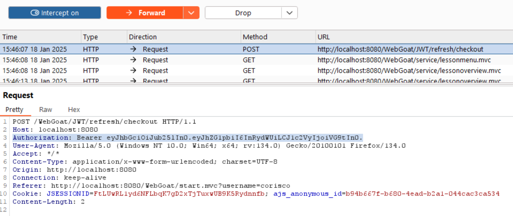

            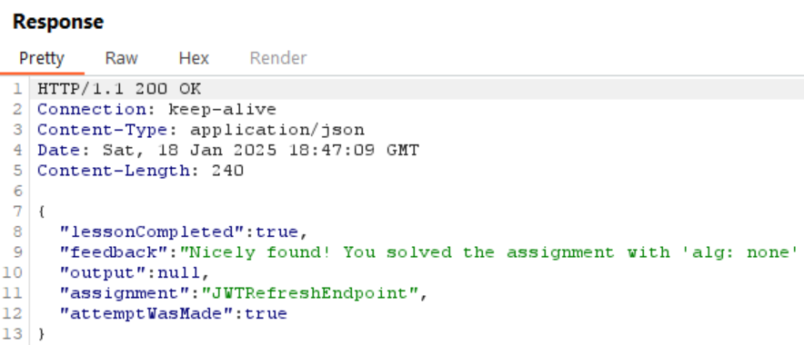

**Diagrama de Fluxo**

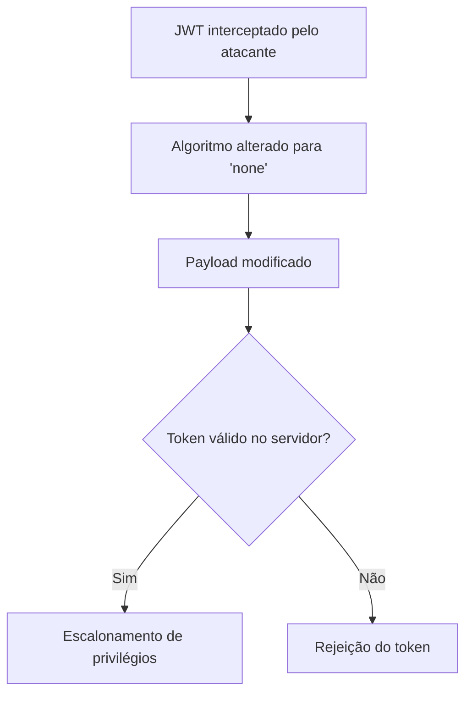


**Impacto**

  - **Escalonamento de Privilégios:** A manipulação do token permitiu que um usuário comum escalasse privilégios para acessar recursos administrativos.
  - **Exposição de Dados Sensíveis:** Informações sensíveis foram expostas devido à falta de validação adequada.
  - **Comprometimento do Sistema:** A falta de verificação no servidor permitiu a execução de ações críticas no sistema.


**CWE (Common Weakness Enumeration)**
  - CWE-347: [Improper Verification of Cryptographic Signature](https://cwe.mitre.org/data/definitions/347.html)
  - CWE-306: [Missing Authentication for Critical Function](https://cwe.mitre.org/data/definitions/306.html)
  
**OWASP Top 10**
        
  - [A01 - Broken Access Control](https://owasp.org/Top10/A01_2021-Broken_Access_Control/)
  
**CVSS (Common Vulnerability Scoring System):**
- 9.1 (Critical)  

    [CVSS:3.1/AV:N/AC:L/PR:N/UI:N/S:U/C:H/I:H/A:N](https://www.first.org/cvss/calculator/3.1#CVSS:3.1/AV:N/AC:L/PR:N/UI:N/S:U/C:H/I:H/A:N)

**Mitigação**  

- **Validação de Assinaturas:** Configure o servidor para rejeitar tokens com algoritmo `none` ou assinaturas inválidas.  
- **Uso de Algoritmos Assimétricos:** Adotar algoritmos de assinatura assimétrica, como `RS256`, para evitar comprometimento da chave.
- **Validação de Payload:** Implementar validação completa do payload no servidor, mesmo que o token seja considerado válido.  
- **Rotação de Chaves:** Rotacionar regularmente chaves e tokens para limitar o impacto de um possível comprometimento. 


## Stored XSS

**Descrição**  
Stored Cross-Site Scripting (Stored XSS) ocorre quando a aplicação armazena de forma insegura entradas fornecidas por usuários, permitindo que scripts maliciosos sejam executados em outros usuários ou processados pelo backend. Essa vulnerabilidade pode ser explorada para comprometer a integridade dos dados e executar ações não autorizadas.

**Exploração**

1. Identificação da Funcionalidade Vulnerável  

    - A função `webgoat.customjs.phoneHome` interage com o backend pelo endpoint `CrossSiteScripting/phone-home-xss`. Esta funcionalidade aceita dados que podem ser manipulados para explorar a vulnerabilidade.

        ```javascript
        webgoat.customjs.phoneHome = function (e) {
                        console.log('phoneHome invoked');
                        webgoat.customjs.jquery.ajax({
                            method: "POST",
                            url: "CrossSiteScripting/phone-home-xss",
                            data: {param1: 42, param2: 24},
                            headers: {
                                "webgoat-requested-by": "dom-xss-vuln"
                            },
                            contentType: 'application/x-www-form-urlencoded; charset=UTF-8',
                            success: function (data) {
                                console.log('phone home said '  + JSON.stringify(data));
                            }
                        });
                    }
        ```
2. **Inserção do Payload**  
     - Foi inserido um script malicioso no campo de comentários da aplicação, que permaneceu armazenado no sistema.
  
        ```html
        stored XSS <script>webgoat.customjs.phoneHome()</script>
        ```
        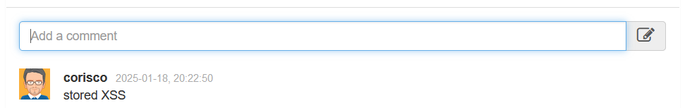

3. **Execução do Payload**  
     - Saída Observada: Ao acessar novamente o comentário, o script malicioso foi executado, gerando uma requisição `POST` ao backend, que processou a entrada e retornou dados manipulados.


        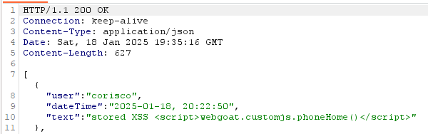

        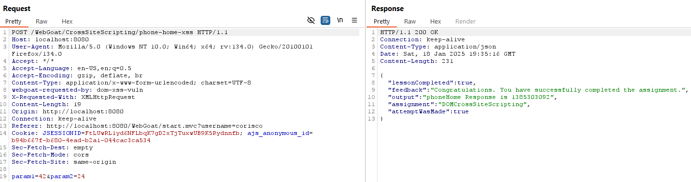

**Diagrama de Fluxo**

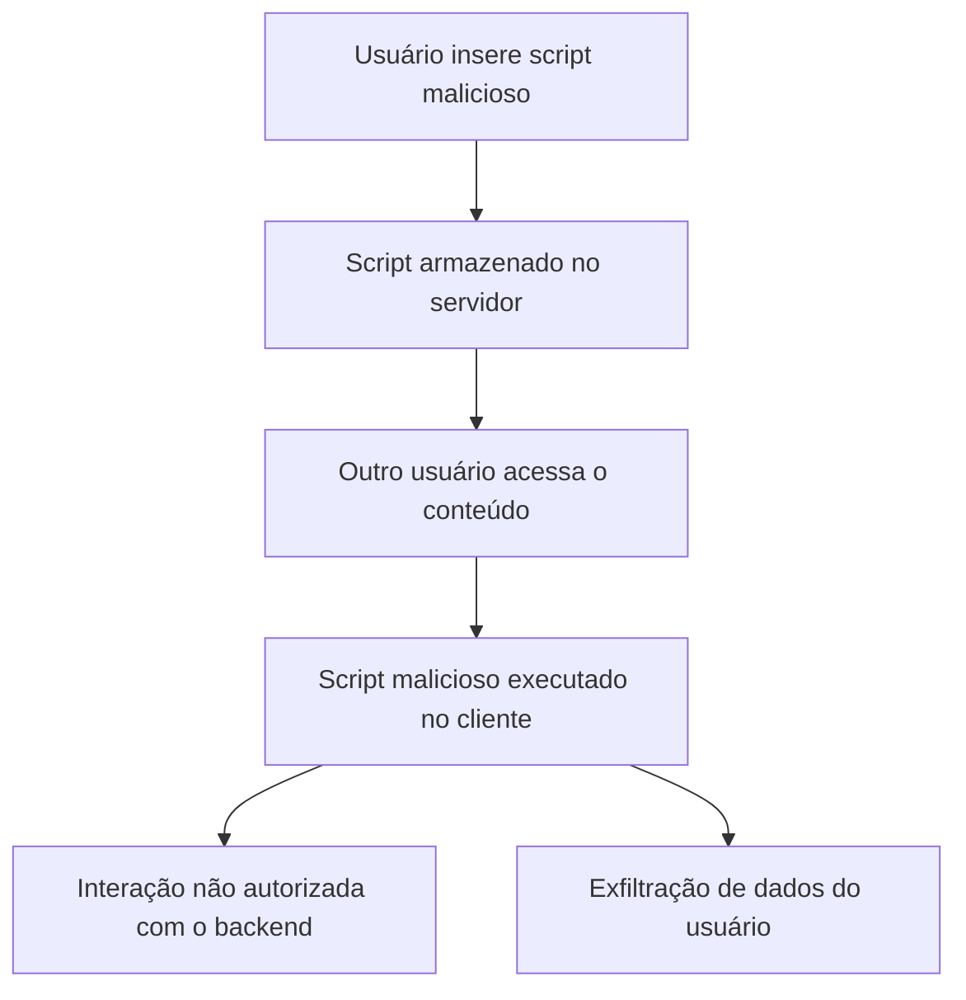
**Impacto**  
- **Execução no Backend:** Scripts maliciosos foram processados diretamente pelo backend, permitindo interações não autorizadas com APIs internas.  
- **Persistência do Ataque:** O payload armazenado foi processado a cada acesso, aumentando o risco de exploração contínua.  
- **Comprometimento de Funcionalidades:** APIs internas, como `phoneHome`, podem ser exploradas para ações não autorizadas.

**CWE (Common Weakness Enumeration)**  
- [CWE-79: Improper Neutralization of Input During Web Page Generation ('Cross-site Scripting')](https://cwe.mitre.org/data/definitions/79.html).  

**OWASP Top 10**  
- [A03: Injection](https://owasp.org/Top10/A03_2021-Injection/).  

**CVSS (Common Vulnerability Scoring System):**  
- 8.5 (High)  
  [CVSS:3.1/AV:N/AC:L/PR:L/UI:N/S:C/C:H/I:L/A:N](https://www.first.org/cvss/calculator/3.1#CVSS:3.1/AV:N/AC:L/PR:L/UI:N/S:C/C:H/I:L/A:N)  

**Mitigação**  
- **Sanitização de Entradas:** Sanitizar todas as entradas recebidas, removendo ou codificando scripts maliciosos antes de armazená-las.
- **Escapamento de Saída:** Certificar-se de que os dados exibidos no front-end sejam escapados, prevenindo a execução de scripts.  
- **Política de Segurança de Conteúdo (CSP):** Implementar uma Política de Segurança de Conteúdo (CSP) para restringir a execução de scripts não confiáveis.

---

Pedro Coelho @ 2025

